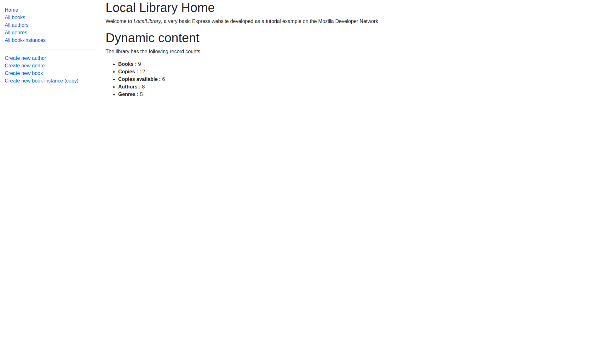

### Local Library

A project built following the <a href='https://developer.mozilla.org/en-US/docs/Learn/Server-side/Express_Nodejs/deployment#in_this_module'> express tutorial on MDN website.</a>

Can be found <a href='https://stormy-sea-41422.herokuapp.com/catalog'>here</a>,deployed with heroku.

# About

The original tutorial makes use of PUG as the view language. I stuck with ejs since it feels more natural since the syntax resembles that of HTML && JSX.

In the main page there is a collection of all-around info concerning the page plus a sidenav for user-navigation. From there on the user can interact following the CRUD model to manipulate all sorts of data concerning book entries ( author, bookinstances, books && genres).

# Tools Used :

<ul>
  <li>Express</li>
  <li>MongoDB and Mongoose</li>
  <li>MVC pattern</li>
  <li>Date-fns</li>
  <li>Express-validator</li>
  <li>Helmet</li>
  <li>Luxon</li>
  <li>Async-module</li>
  <li>Dotenv</li>
<ul>
